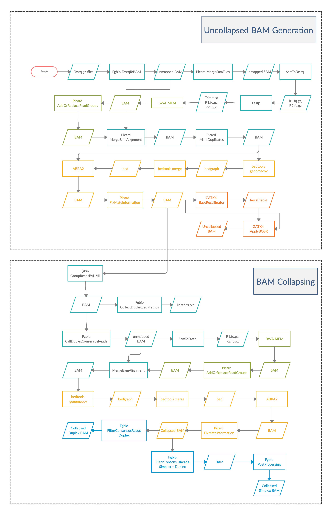

# Introduction

 [](https://pyup.io/repos/github/msk-access/nucleo/) [](https://pyup.io/repos/github/msk-access/nucleo/)

* Free software: Apache Software License 2.0
* Documentation: [https://msk-access.gitbook.io/nucleo](https://msk-access.gitbook.io/nucleo)

## Features

Given a pair-end fastq file generate collapsed fastq and standard, unfiltered, duplex and simplex Binary Alignment File



## Installation

Clone the repository:

```
git clone --depth 50 https://github.com/msk-access/nucleo.git
```

## Credits

* CMO cfDNA Informatics Team
* Cookiecutter: [https://github.com/audreyr/cookiecutter](https://github.com/audreyr/cookiecutter)
* `audreyr/cookiecutter-pypackage`: [https://github.com/audreyr/cookiecutter-pypackage](https://github.com/audreyr/cookiecutter-pypackage)
